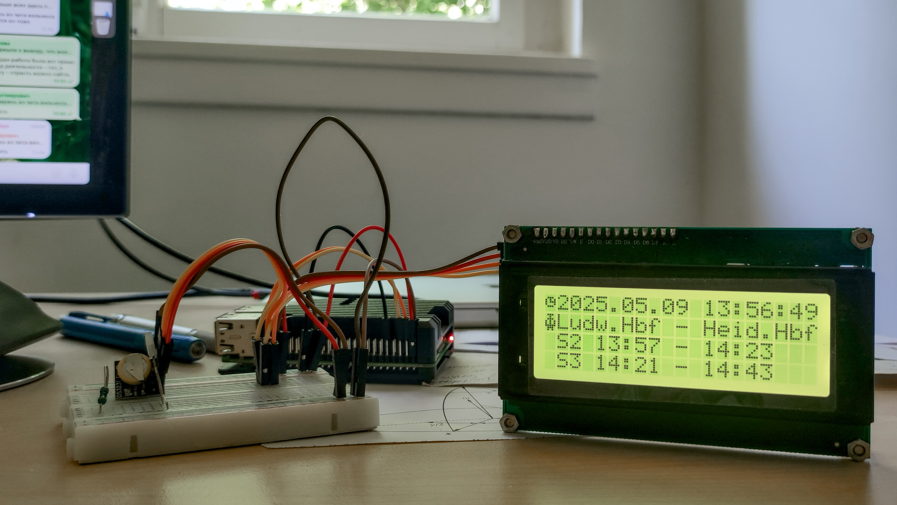

# RPIDBClock

## A .NET Raspberry PI Commuter Desk Clock

### What is this all about

**RPIDBClock** is a thoughtfully crafted Raspberry Pi project written in **.NET** that turns a simple LCD display into a smart desk clock with **real-time Deutsche Bahn departures**. It’s not just a clock — it’s a personal mobility companion designed for people who should be in sync with the train schedule. 

**Technically**, it is the Raspberry PI, connected to the DS3231 RTC module and the HD44780 LCD module with four lines by twenty symbols each.

### Motivation Story

Initially, I built this clock for my desk because I was tired of missing trains after long coding hours. I wanted a reminder that speaks my language — clear, precise, and human-readable — and also have it displayed on the dedicated display I like to see.

After getting the first working version, I can say that this project shows that .NET on Raspberry Pi isn’t just possible — it’s a pleasure to work with for IoT and automation tasks.

### Project Features
	•	Displays current date and time using a DS3231 hardware RTC
	•	Shows the next two Deutsche Bahn train departures from a personal schedule
	•	Runs as a Linux service on Raspberry Pi
	•	Clean .NET design with dependency injection and unit tests

### Technical Results

Built to explore how expressive and maintainable .NET can be in automation and embedded scenarios, RPIDBClock demonstrates:
- Reliable real-time timekeeping using a DS3231 RTC module.
- Elegant hardware interaction via I2C (LCD and RTC).
- Clean architecture with dependency injection, testability, and remote debugging.
- Headless deployment workflows with simple bash scripts. The application can be built on the developer machine, deployed to the RPI via SSH, and executed as a service. For this purpose, the set of bash scripts was developed inside the project.

### Future Development Directions
- Add a WEB UI for configuring.
- Add PWM brightness control.
- Find out how to reliably integrate with the actual live train schedule with train delays.
- Add an infra-red human presence detector to turn off the display backlight when nobody is there to see it.

When the application is executed, it updates the RTC's time from an NTP server (if the network is available), then periodically retrieves the RTC's time. It has a hardcoded schedule of the trains I need to monitor for the commute, and displays the closest trains I can reach from my workplace. Yes, that's a shame to have it hardcoded. Currently, I limited it by filtering one of the DB-scheduling service responses. Maybe later I'll make it updateable on its own, but not right now, because the average time for a tram commute is shorter than for a train commute, so I don't use it since I changed my commute path.

The project's architecture uses Dependency Injection. It allows me to experiment with different configurations and to use stubs for some classes to play with others in unit tests, which I added to the project to protect already implemented logic from corruption during refactoring and optimization activities.

For the project, I've used a very old Raspberry Pi 3B (just because I own it), so it is possible with a modern one, and I expect it to have a shorter startup time.

## Documentation reference

- [Some useful command line spells](Doc/Cmd/Readme.md)
Just to have a place for copy-paste from, and not to type it every time.

- [The configuration of the service on the RPI](Doc/Adm/Readme.md)
This is a process separate from software development itself, which warrants some dedicated description.

- [Raw research documentation on the train schedule provider quiring](Doc/MyVRN/Readme.md)
This is the most difficult and fragile part of the project, at least because there is no warranty of the data provider's format stability. To do this part seriously, we should be somehow connected to the data provider organization to obtain the necessary permissions and documentation for proper use of the service.
